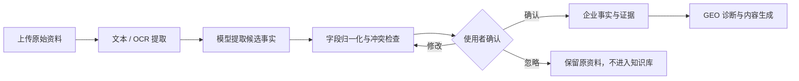
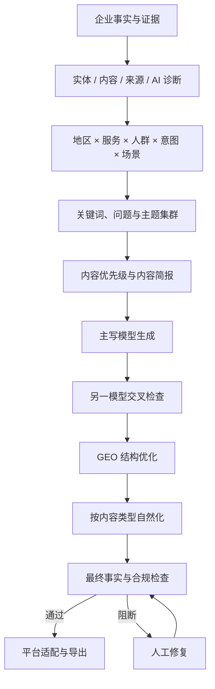
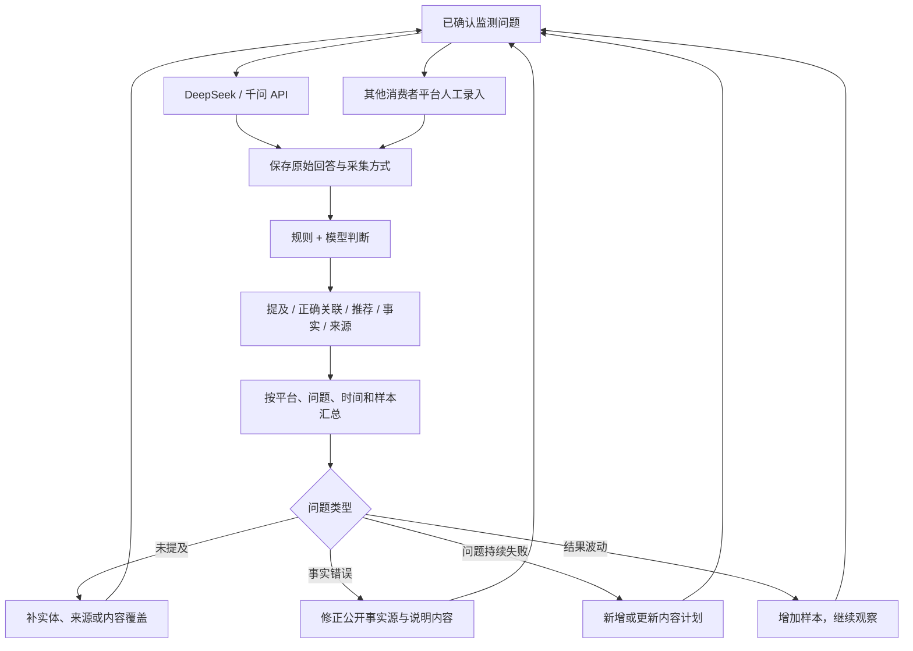

# 核心业务链路

Status: 阶段 C 定稿

## 企业事实链路

```mermaid
flowchart LR
    A["上传原始资料"] --> B["文本 / OCR 提取"]
    B --> C["模型提取候选事实"]
    C --> D["字段归一化与冲突检查"]
    D --> E{"使用者确认"}
    E -->|确认| F["企业事实与证据"]
    E -->|修改| D
    E -->|忽略| G["保留原资料，不进入知识库"]
    F --> H["GEO 诊断与内容生成"]
```

## GEO 策略与内容链路

```mermaid
flowchart TD
    KB["企业事实与证据"] --> DG["实体 / 内容 / 来源 / AI 诊断"]
    DG --> Q["地区 × 服务 × 人群 × 意图 × 场景"]
    Q --> T["关键词、问题与主题集群"]
    T --> BP["内容优先级与内容简报"]
    BP --> W["主写模型生成"]
    W --> R["另一模型交叉检查"]
    R --> G["GEO 结构优化"]
    G --> H["按内容类型自然化"]
    H --> F["最终事实与合规检查"]
    F -->|通过| O["平台适配与导出"]
    F -->|阻断| FIX["人工修复"]
    FIX --> F
```

## 多平台监测与反馈链路

```mermaid
flowchart TD
    Q["已确认监测问题"] --> A["DeepSeek / 千问 API"]
    Q --> M["其他消费者平台人工录入"]
    A --> RAW["保存原始回答与采集方式"]
    M --> RAW
    RAW --> J["规则 + 模型判断"]
    J --> S["提及 / 正确关联 / 推荐 / 事实 / 来源"]
    S --> AGG["按平台、问题、时间和样本汇总"]
    AGG --> MAP{"问题类型"}
    MAP -->|未提及| E["补实体、来源或内容覆盖"]
    MAP -->|事实错误| C["修正公开事实源与说明内容"]
    MAP -->|问题持续失败| P["新增或更新内容计划"]
    MAP -->|结果波动| R["增加样本，继续观察"]
    E --> Q
    C --> Q
    P --> Q
    R --> Q
```
