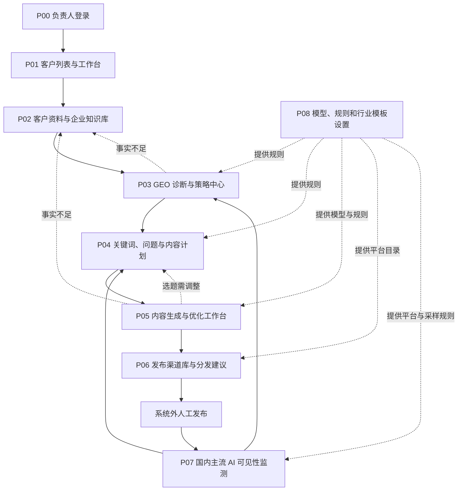

# 用户主流程

Status: 阶段 C 定稿

```mermaid
flowchart TD
    P00["P00 负责人登录"] --> P01["P01 客户列表与工作台"]
    P01 --> P02["P02 客户资料与企业知识库"]
    P02 --> P03["P03 GEO 诊断与策略中心"]
    P03 --> P04["P04 关键词、问题与内容计划"]
    P04 --> P05["P05 内容生成与优化工作台"]
    P05 --> P06["P06 发布渠道库与分发建议"]
    P06 --> EXT["系统外人工发布"]
    EXT --> P07["P07 国内主流 AI 可见性监测"]
    P07 --> P03
    P07 --> P04

    P08["P08 模型、规则和行业模板设置"] -.提供规则.-> P03
    P08 -.提供规则.-> P04
    P08 -.提供模型与规则.-> P05
    P08 -.提供平台目录.-> P06
    P08 -.提供平台与采样规则.-> P07

    P03 -.事实不足.-> P02
    P05 -.事实不足.-> P02
    P05 -.选题需调整.-> P04
```

## 导航规则

- P01—P08 均可从统一侧边栏进入。
- P02—P07 必须先选择当前客户。
- P03、P04、P05、P06、P07 构成单个客户的 GEO 循环。
- P06 只提供渠道建议和官方入口，发布动作发生在系统外。
- P07 的结果只形成诊断和内容建议，不自动修改客户事实或发布内容。
